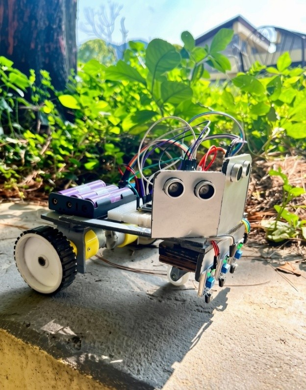
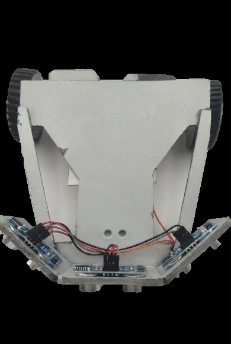
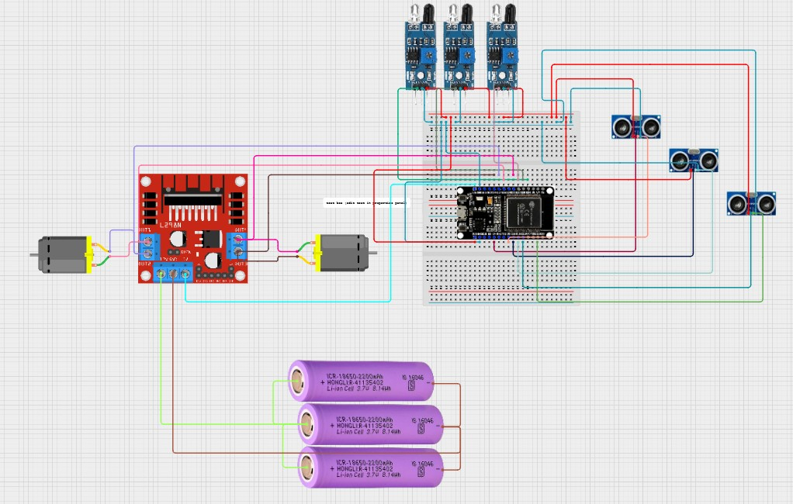

# Nexus

> An ESP32-powered autonomous robot combining line following, obstacle avoidance, and browser-based manual control. Built by a 5-person team during a 2-week robotics competition.



---

## Table of Contents

- [Overview](#overview)
- [Team](#team)
- [Features](#features)
- [Hardware Architecture](#hardware-architecture)
- [Software Stack](#software-stack)
- [Navigation Logic](#navigation-logic)
- [Manual Control](#manual-control)
- [Project Gallery](#project-gallery)
- [Competition Results](#competition-results)
- [Engineering Postmortem](#engineering-postmortem)
- [Future Improvements](#future-improvements)
- [License](#license)

---

## Overview

Nexus is a multifunctional mobile robot developed during a two-week robotics workshop and competition organized by the college's Robotics Club. The robot demonstrates intelligent mode-switching between autonomous navigation strategies based on real-time sensor data.

**Key innovation:** Rather than relying on a single navigation method, Nexus dynamically transitions between line following and ultrasonic-based obstacle avoidance. When all line sensors lose the track simultaneously, the robot automatically switches to wall avoidance mode—allowing it to continue navigating environments where traditional line-following alone would fail.

The project reached the competition **semifinals** and serves as a case study in both robust robotics design and the importance of operational discipline in competitive engineering.

---

## Team

| Name | Department |
|------|------------|
| Prasanna Bahadur Adhikari | BEI |
| Prashant Gaihre | BEI |
| Bijay Ghimire | BCT |
| Rasna Tamang | BEL |
| Saujan Gurung | BME |

**Mentor:** Prakat Sharma

---

## Features

- ✅ **Autonomous line following** with 3-sensor array for precision path tracking
- ✅ **Automatic mode-switching** to obstacle avoidance when line is lost
- ✅ **WiFi manual control** via browser-based joystick interface (ESP32 AP mode)
- ✅ **Dual-motor system** with independent PWM speed control
- ✅ **Custom arrow-shaped chassis** designed for optimal sensor placement
- ✅ **Real-time sensor fusion** for intelligent navigation decisions
- ✅ **Low-power voltage regulation** using dual buck converters
- ✅ **Zero external infrastructure** — robot hosts its own WiFi network

---

## Hardware Architecture

### Bill of Materials

| Component | Specification | Purpose |
|-----------|---------------|----------|
| **Microcontroller** | ESP32 | Main processor, WiFi AP, GPIO control |
| **Motor Driver** | L298N | PWM-based motor speed control |
| **Motors** | 2× 4V DC geared motors | Differential drive system |
| **Power** | 3× 4V batteries (series) | 12V nominal supply |
| **Voltage Regulation** | 2× buck converters | 12V→5V (ESP32/sensors), 12V→3.3V (logic) |
| **Line Detection** | 3× IR sensors | Mounted front-center, left, right |
| **Obstacle Detection** | 3× ultrasonic sensors | Front, left, right positions |
| **Chassis** | Custom designed | Arrow/dart shape for aerodynamic profile |

### System Diagram

```
                    ┌─────────────────┐
                    │      ESP32      │
                    │   (AP + GPIO)   │
                    └────────┬────────┘
                             │
          ┌──────────────────┼──────────────────┐
          │                  │                  │
      ┌───▼──┐          ┌───▼──┐          ┌───▼──┐
      │  IR  │          │  PWM │          │WiFi  │
      │Sensors│          │Motor │          │AP    │
      └───┬──┘          │Driver│          └──────┘
          │              └───┬──┘
          │                  │
          └────────��─┬───────┘
                     │
            ┌────────▼────────┐
            │ Decision Logic  │
            │ (Mode Switch)   │
            └────────┬────────┘
                     │
          ┌──────────┴──────────┐
          │                     │
       ┌──▼──┐            ┌────▼────┐
       │Left │            │ Right   │
       │Motor│            │ Motor   │
       └─────┘            └─────────┘
```

### Power Distribution

```
12V Battery Pack (3× 4V)
        │
        ├──────────┬──────────┐
        │          │          │
     ┌──▼──┐   ┌──▼──┐   ┌───▼──┐
     │L298N│   │Buck │   │Buck  │
     │(12V)│   │Conv1│   │Conv2 │
     └──┬──┘   └──┬──┘   └───┬──┘
        │         │          │
     Motors    5V Rail    3.3V Rail
                │            │
             Sensors      Logic (ESP32)
```

---

## Software Stack

- **Language:** C++
- **IDE:** Arduino IDE
- **Microcontroller SDK:** ESP32 Arduino core
- **WiFi Protocol:** 802.11n (ESP32 AP mode)
- **Motor Control:** PWM via GPIO
- **Web Interface:** HTML5/CSS3/JavaScript
- **Sensor Interface:** GPIO digital/analog read, PWM generation

---

## Navigation Logic

### Mode 1: Line Following (Default)

The robot uses three IR sensors mounted horizontally across the front to detect the track.

```
IR_LEFT     IR_CENTER     IR_RIGHT
   ○           ○             ○
   └───────────┴─────────────┘
```

**Behavior:**
- Read all three sensors continuously
- Adjust left/right motor speeds to maintain center alignment
- Smoothly follow curves by varying differential speed

**Sensor Logic:**
```
Center ON, Left OFF, Right OFF    → Go straight
Center ON, Left ON, Right OFF     → Turn right
Center ON, Left OFF, Right ON     → Turn left
All ON                             → Intersection (go straight)
```

### Automatic Mode Switching

**Trigger condition:**
```
IR_LEFT = OFF  AND  IR_CENTER = OFF  AND  IR_RIGHT = OFF
```

When all three sensors simultaneously lose the line, the robot interprets this as either:
- End of the visible track
- A gap or intersection too wide to track
- Arena boundary

Instead of stopping, Nexus **automatically switches to obstacle avoidance mode**.

```
    Line Following Active
            ↓
    All IR Sensors OFF
            ↓
        Mode Switch
            ↓
    Obstacle Avoidance Active
            ↓
    (Continue until line detected OR manual override)
```

### Mode 2: Obstacle Avoidance

With the line lost, the robot relies on three ultrasonic sensors for navigation.

```
ULTRASONIC_FRONT   ULTRASONIC_LEFT   ULTRASONIC_RIGHT
        ○                  ○                  ○
```

**Behavior:**
- Measure distances to obstacles in three directions
- Select the clearest path (farthest distance)
- Move toward open space
- Resume line following if any IR sensor detects the track again

**Decision Tree:**
```
Check Front Sensor
├─ Clear (>X cm)      → Move forward
├─ Blocked           → Check sides
│   ├─ Left clear    → Turn left and move
│   └─ Right clear   → Turn right and move
└─ All blocked       → Stop or rotate in place
```

---

## Manual Control

The ESP32 runs as a **WiFi Access Point (AP mode)**, requiring no external router or network infrastructure.

### Connection Sequence

1. Power on robot
2. ESP32 broadcasts SSID: `Nexus_Bot` (or configured name)
3. Connect from phone/laptop to this network
4. Open browser to `192.168.4.1`
5. Load web-based joystick interface
6. Use virtual analog stick to drive manually

### Features

- **Low-latency wireless** — Direct ESP32↔browser communication
- **No network dependency** — Works anywhere with power
- **Graceful fallback** — Manual control overrides all autonomous modes
- **Touch-friendly** — Optimized for phone/tablet joystick

### Web Interface Structure

```
web/
└── joystick_interface/
    ├── index.html         # Main page
    ├── style.css          # Styling
    └── controls.js        # Joystick logic & WebSocket comms
```

---

## Project Gallery

### Robot Assembly


*Caption: Nexus in final assembled form, arrow-shaped chassis with sensors mounted.*

### Custom Chassis Design



*Caption: Custom dart-shaped design for optimal sensor field-of-view and weight distribution.*

### Wiring & Electronics



*Caption: Power distribution, motor driver, buck converters, and ESP32 mounted on custom PCB.*

### Competition Action


*Caption: Robot navigating the track during preliminary rounds.*

---

## Repository Structure

```
Nexus/
│
├── README.md                  # This file
├── LICENSE                    # MIT License
│
├── firmware/
│   └── Integrated_LINE_WALL.ino    # Main Arduino sketch
│
├── web/
│   └── joystick_interface/
│       ├── index.html         # Web UI
│       ├── style.css          # Styling
│       └── controls.js        # Joystick & communication logic
│
├── docs/
│   ├── postmortem.md          # Competition lessons learned
│   ├── ARCHITECTURE.md        # Detailed system design
│   ├── wiring_diagram.png     # Circuit diagram
│   └── sensor_calibration.md  # Tuning guide
│
└── images/
    ├── robot.jpg              # Main product shot
    ├── chassis.jpg            # Mechanical design
    ├── wiring.jpg             # Electronics close-up
    └── competition.jpg        # Action shot
```

---

## Competition Results

- **Duration:** 2-week robotics workshop & competition
- **Status:** Reached **semifinals**
- **Performance:** 
  - Successfully completed autonomous navigation challenges in preliminary rounds
  - Demonstrated robust mode-switching and sensor fusion capabilities
  - Proved reliable wireless manual control under competitive conditions
- **Outcome:** Eliminated in semifinals due to operational oversight (see [Postmortem](#engineering-postmortem))

---

## Engineering Postmortem

### What Happened

During the semifinal round, Nexus completed its calibration phase without issue. When the official match began, the robot failed to move. After investigation, we identified the root cause: **battery voltage had depleted significantly during the calibration period, and we had not verified the battery level before the match.**

This was not a design flaw, software bug, or navigation failure. It was a **process failure**—a gap in our pre-match operational checklist.

### Root Cause Analysis

We made two critical assumptions:

1. **"Successful calibration implies sufficient power"** — We didn't distinguish between "calibration ran without crash" and "systems have adequate voltage margin for match."
2. **"Our robot is ready once it boots"** — We had no verification checklist between the calibration period and the official run.

Combined with the sleep deprivation from staying on campus for 2 consecutive days (including an all-nighter), this operational blind spot proved fatal.

### Why This Matters

Robotics success depends equally on **engineering** and **discipline**.

A well-designed robot can fail if deployment procedures are inadequate. In competitive environments, operational rigor is as critical as code quality. This failure taught us that engineering excellence includes:

- Standardized pre-match checklists
- Separation of concerns (calibration ≠ match readiness)
- Explicit voltage verification, not assumptions
- Fatigue-resistant processes (don't rely on human judgment after 30+ hours awake)

### Lessons & Changes for Next Competition

We would implement a **mandatory pre-match verification checklist**:

```
☐ Battery voltage check (minimum 11.5V for 12V system)
☐ Sensor connectivity test (IR + ultrasonic)
☐ Motor speed test (independent left/right)
☐ WiFi AP broadcast & manual control test
☐ Autonomous mode test (line following for 10 seconds)
☐ Mode-switch trigger test (place on non-track area)
☐ Emergency stop responsiveness
☐ Final calibration (fresh sensors, no prior exhaustion)
```

Additionally:

- **Battery monitoring:** Add low-voltage warning (software and hardware)
- **Fatigue protocol:** Rotate team members during prep; no individual works >6 hours without break
- **Separate calibration/competition timelines:** Never assume one implies readiness for the other
- **Test after rest:** Verify systems after sleep, not during sleep-deprivation window

---

## Future Improvements

**Near-term (Next Competition):**
- [ ] Battery voltage monitoring with auto-shutdown
- [ ] Motor encoder feedback for position tracking
- [ ] Improved ultrasonic algorithm (distance weighting)
- [ ] Wireless telemetry dashboard

**Medium-term:**
- [ ] PID controller tuning for smoother curves
- [ ] Better chassis weight distribution
- [ ] Redundant sensor architecture (>3 IR sensors)
- [ ] OTA firmware updates

**Long-term:**
- [ ] ROS 2 integration for scalability
- [ ] SLAM-based navigation
- [ ] Computer vision for color-based track detection
- [ ] Multi-robot coordination

---

## License

MIT License — See `LICENSE` file for details.

---

## Acknowledgements

Thanks to:
- **Paschimanchal Campus Robotics Club** for organizing the workshop and competition
- **Prakat Sharma**, our mentor, for guidance and feedback
- **All team members** for their late nights, problem-solving, and collaborative spirit
- The robotics community for the collective wisdom applied to this project

---

**Questions? Open an issue or reach out to the team.**
